# 🎫 Jira Ticketing Helper Chatbot

An intelligent chatbot that assists with **Jira ticketing support**. This bot helps users create, update, and fetch Jira tickets, leveraging **Google Drive documentation**, **Pinecone**, **OpenAI**, and **Telegram** with an **n8n automation pipeline**.

## 🚀 Features
- 📂 Fetches Jira help guides and SOPs stored in **Google Drive**
- 🔍 Converts Jira docs into embeddings using **OpenAI**
- 📊 Stores and searches embeddings efficiently with **Pinecone Vector DB**
- 🤖 Uses **OpenAI Chat Model** to provide contextual Jira ticketing support
- 🔗 Automated workflows managed via **n8n**
- 💬 Integrated with **Telegram Bot**
- 🎫 Supports **Jira API** to create, update, and fetch ticket status

## 🛠️ Tech Stack
- **n8n** — Workflow automation
- **OpenAI** — Embeddings & conversational responses
- **Pinecone** — Vector DB for semantic search
- **Telegram Bot API** — Messaging and interaction
- **Google Drive API** — Documentation retrieval
- **Jira REST API** — Ticket creation, updates, and status checks

## ⚙️ Architecture Flow

### 🔹 Workflow Diagram (Mermaid)

```mermaid
flowchart TD
    A[📂 Google Drive API] -->|Fetch Jira Docs| B[n8n Workflow]
    B -->|Convert to Embeddings| C[🔎 OpenAI Embeddings]
    C -->|Store & Search| D[📊 Pinecone Vector DB]
    D -->|Retrieve Context| E[🤖 OpenAI Chat Model]
    E -->|Answer Generated| F[💬 Telegram Bot]
    F -->|Ticket Commands| G[🎫 Jira REST API]
```


### 🔹 ASCII Flow
```
[Google Drive Docs] --> [n8n Workflow] --> [OpenAI Embeddings] --> [Pinecone Vector DB]
                                                                    |
                                                                    v
                                                         [OpenAI Chat Model] --> [Telegram Bot] --> [Jira API]
```

## 📦 Setup Instructions

### 1) Clone Repository
```bash
git clone https://github.com/anuradha2504/JIra-Ticket-helper-chatbot
cd jira-ticketing-chatbot
```

### 2) Environment Variables
Create a `.env` file in the project root:
```
OPENAI_API_KEY=your_openai_key
OPENAI_EMBEDDING_MODEL=text-embedding-3-small
PINECONE_API_KEY=your_pinecone_key
PINECONE_ENVIRONMENT=your_pinecone_env
PINECONE_INDEX=jira-ticketing-chatbot
GOOGLE_DRIVE_API_KEY=your_gdrive_key
TELEGRAM_BOT_TOKEN=your_telegram_bot_token
JIRA_BASE_URL=https://yourdomain.atlassian.net
JIRA_EMAIL=your_jira_email
JIRA_API_TOKEN=your_jira_api_token
```

### 3) Setup n8n
1. Install n8n (Docker, desktop, or server).
2. Import the workflow JSON: `workflows/jira_ticketing_chatbot.json`.
3. Configure credentials for Google Drive, Pinecone, OpenAI, Telegram, and Jira.

### 4) Deploy Pinecone Index
- Create index (e.g., `jira-ticketing-chatbot`).
- Dimension = `1536`.

### 5) Run the Bot
```bash
n8n start
```

## 📌 Example Usage
- **User (Telegram):** “What are the different jira we have”  
- **Bot:** The different Jira types we have include:

1. Story - Example: EGRC-1234 "Develop User Profile Page (Frontend)" with a detailed description and acceptance criteria.
2. Task - Example: EGRC-5678 "Update Database Schema for User Profiles" with specific requirements and acceptance criteria.  

- **User (Telegram):** “what is the status of database jra and who is assign for that?
”  
- **Bot:** FThe status of the database Jira (EGRC-5678) is "To Do" and it is assigned to Seema Vishwas.  

- **User (Telegram):** “Provide the jira no. list which is not completed ?”  
- **Bot:** The list of Jira numbers which are not completed includes:
1. EGRC-1234 (Status: In Progress, Assignee: Tusar Kumar)
2. EGRC-5678 (Status: To Do, Assignee: Seema Vishwas)  

## 🛠️ Troubleshooting
- **Jira ticket not created:** Check Jira API token and permissions.
- **Bot not responding:** Verify Telegram bot token in n8n.
- **No doc-based answers:** Ensure docs are processed and stored in Pinecone.
- **Dimension mismatch error:** Ensure Pinecone index matches embedding model.

---

# 👨‍💻 Author
Built by **Your Name** using automation, AI, and Jira API integrations.
